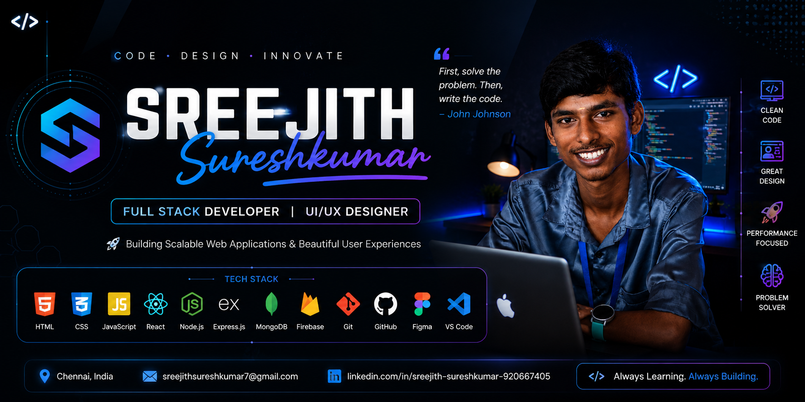

  

# 👋 Hi, I'm Sreejith Sureshkumar

---

# 🚀 About Me

🎓 B.Sc Computer Science Student

💻 Full Stack Developer

🎨 UI/UX Designer

🌱 Currently Learning React.js, Node.js, MongoDB

📍 Chennai, India

---

# 🛠 Tech Stack

---

# 📊 GitHub Stats

---

# 🔥 GitHub Streak

---

# 🏆 GitHub Trophy

  

---

# 🚀 Featured Projects

⭐ Madha Attendance Pro

⭐ Chat Application

⭐ AI Skill Lab

⭐ Portfolio Website

⭐ College Website

⭐ ScanDrive

---

# 🌐 Connect With Me

📧 Email:
**sreejithsureshkumar7@gmail.com**

💼 LinkedIn:
**https://www.linkedin.com/in/sreejith-sureshkumar-920667405**

---

### ⭐ Keep Learning • Keep Building • Keep Growing ⭐

